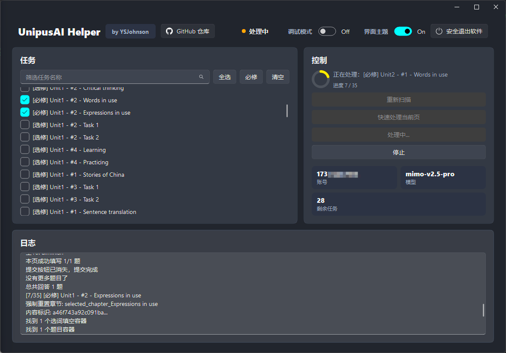
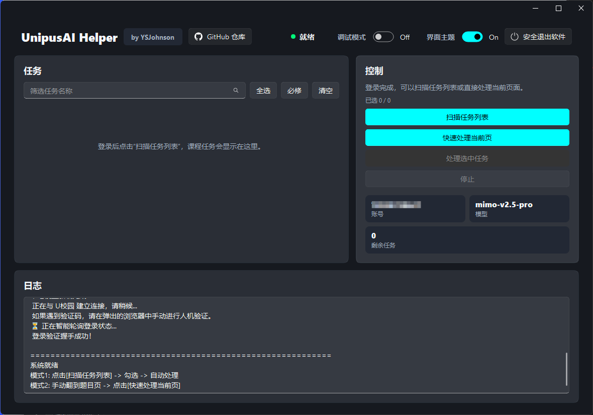
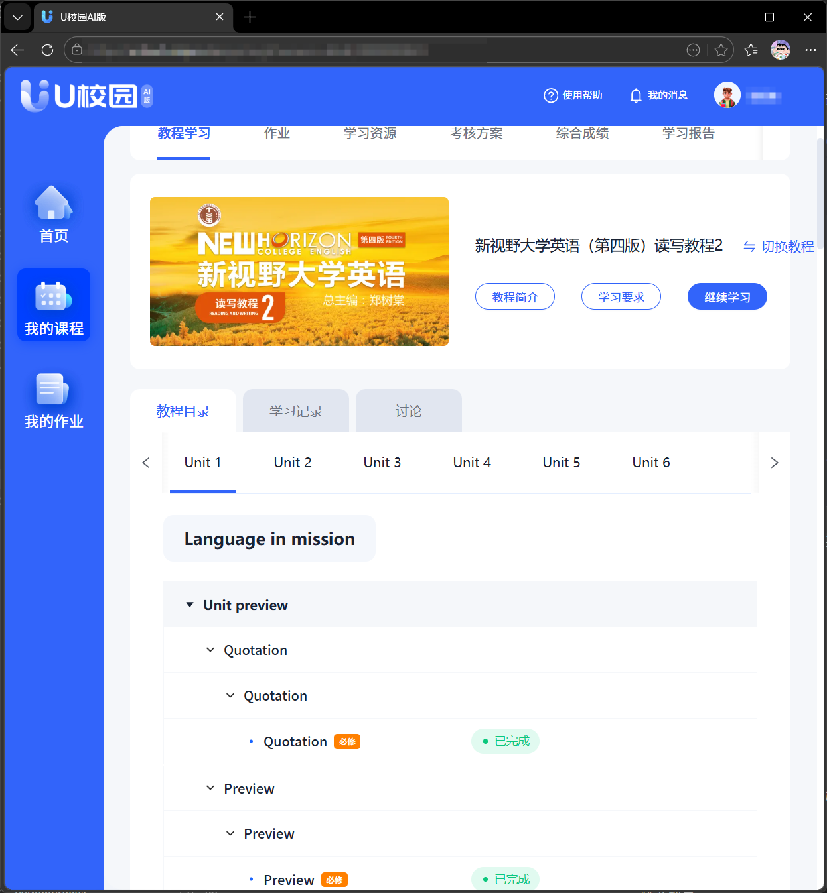
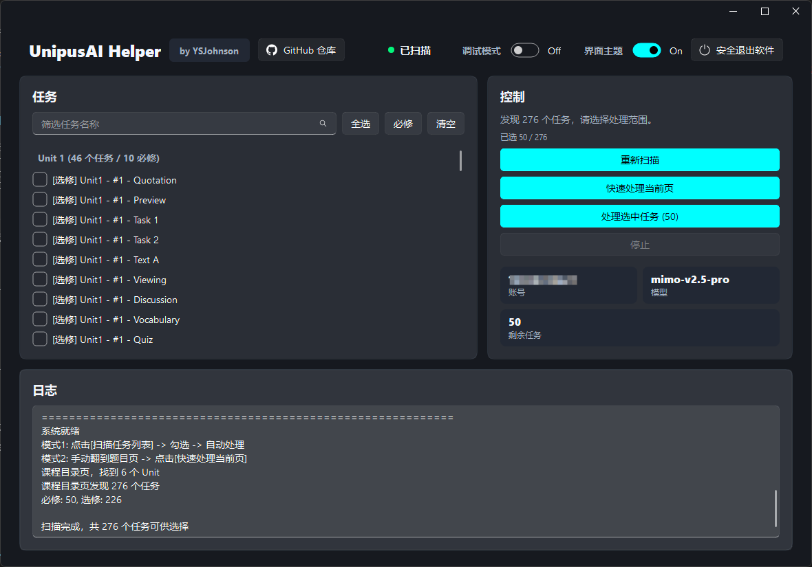
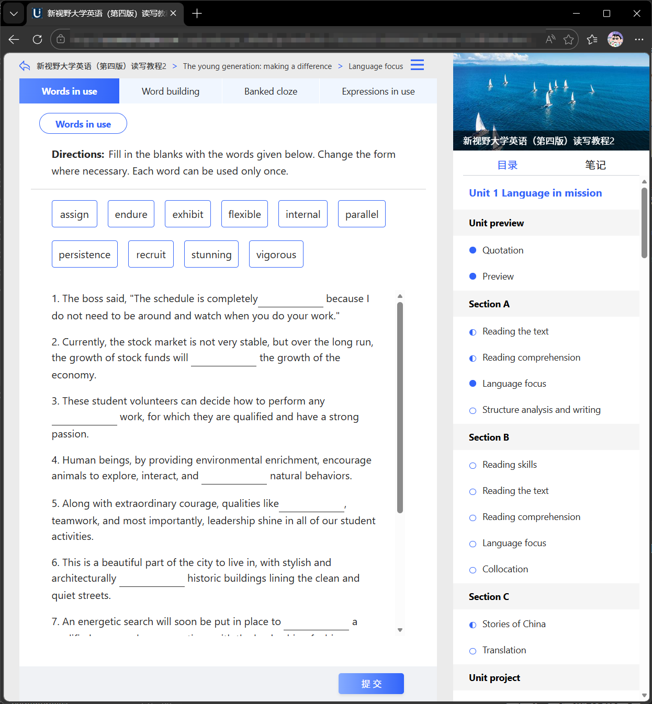
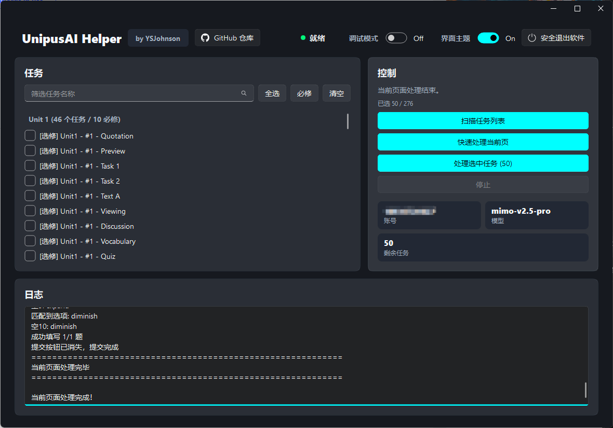
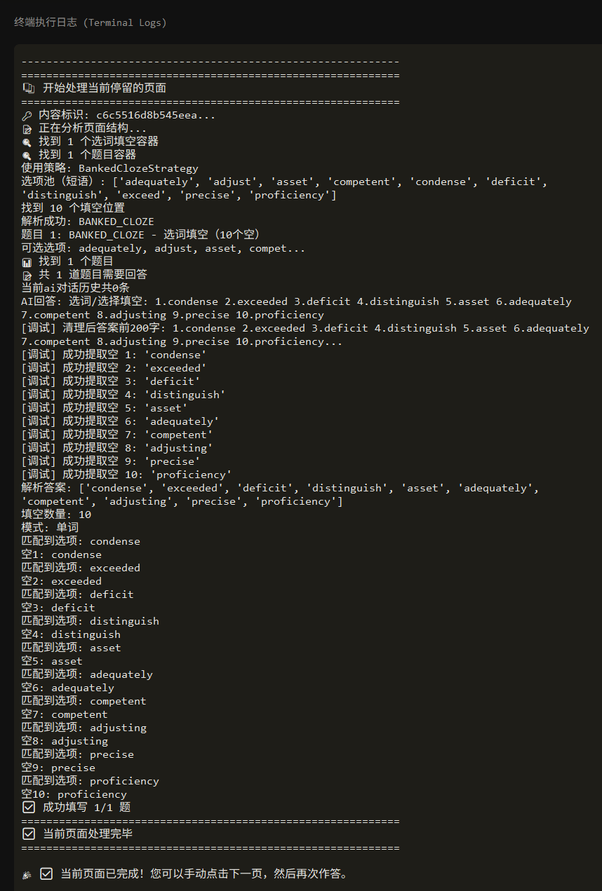

# UnipusAI-Helper

<p align="center">
  
</p>

<p align="center">
  基于 Selenium、Fluent UI 与 OpenAI 兼容接口的 U 校园 AI 版刷课工具
</p>

<p align="center">
  
  
  
  
</p>

原 `UnipusAI_Plus` 项目已彻底重构为 `UnipusAI-Helper`。

## 简介

`UnipusAI-Helper` 是从早期 `UnipusAI_Plus` 重构而来的桌面版工具，主程序为 `UnipusAI_Helper.py`，配置编辑器为 `config_editor.py`，界面为 Fluent 风格。项目重点在于更稳定的 GUI 体验、多任务的批量处理、单页面的手动处理。

---

## 特性

- GUI 控制台：显示任务清单、运行状态、实时日志和调试开关。
- 双模式处理：支持“扫描任务列表”批量处理，也支持“快速处理当前页”。
- 多题型处理：支持单选、多选、填空、写作、选词填空、下拉选择、词汇测试、听力填空、视频任务、视频弹窗题、词汇闪卡。
- 音视频辅助：支持本地 Whisper 转写。
- 环境检查：启动时检查 Edge、FFmpeg、网络和运行环境。
- 配置编辑器：提供独立 GUI 编辑器，减少手动修改 JSON 出错的概率。

---

## 项目结构

```text
UnipusAI-Helper/
├── UnipusAI_Helper.py
├── fluent_ui.py
├── config_editor.py
├── EnvironmentChecker.py
├── AudioRecognizer.py
├── config.json
├── requirements.txt
└── images/
```

---

## 运行环境

- Windows 10/11
- Python 3.8+
- Microsoft Edge
- FFmpeg
- OpenAI 兼容大模型接口

安装依赖：

```bash
pip install -r requirements.txt
```

---

## 使用方法

### 方式一：直接下载 Release（适合小白）

如果只是使用，不打算自己改代码，直接在 GitHub 的 `Releases` 页面下载打包好的主程序和配置编辑器即可。

1. 下载并解压发布包。
2. 运行配置编辑器并填写配置。
3. 启动主程序。

### 方式二：源码运行

```bash
git clone https://github.com/YSJohnson/UnipusAI-Helper.git
cd UnipusAI-Helper
pip install -r requirements.txt
python config_editor.py
python UnipusAI_Helper.py
```

如需跳过环境检查：

```bash
python UnipusAI_Helper.py --skip-check
```

---

## 配置说明

项目使用 `config.json` 作为本地配置文件，建议使用配置编辑器而不是手动修改。

```json
{
  "username": "",
  "password": "",
  "url": "https://uai.unipus.cn/sso/index.html?service=https%3A%2F%2Fucloud.unipus.cn%2Fhome",
  "api_key": "",
  "base_url": "",
  "model": "",
  "max_tokens": 8192,
  "temperature": 0.3,
  "token_full": "",
  "debug_mode": false
}
```

| 字段 | 说明 |
| --- | --- |
| `username` | U 校园 AI 版账号 |
| `password` | U 校园 AI 版密码 |
| `url` | 登录入口，默认即可 |
| `api_key` | 大模型接口密钥 |
| `base_url` | OpenAI 兼容接口地址 |
| `model` | 模型名称 |
| `max_tokens` | 最大 token 数，默认即可 |
| `temperature` | 生成温度，默认即可 |
| `token_full` | 浏览器本地存储中的 `__token`，用于绕过平台的反作弊系统 |
| `debug_mode` | 是否开启调试日志 |

> 脚本不限制大模型提供商，所以理论上所有支持 OpenAI 兼容接口的提供商都支持。目前测试过 DeepSeek、硅基流动、Kimi 兼容接口。

## 获取 `token_full`

1. 在浏览器中手动登录 U 校园 AI 版。
2. 打开 F12 开发者工具，进入 `Console` / `控制台`。
3. 输入并执行：

```javascript
localStorage.getItem('__token')
```

4. 将结果填写到配置文件的 `token_full`。

> [!IMPORTANT]
> 由于 token 的值必须是字符串类型，获取的 token_full 不能直接使用，你必须在所有内部的双引号前加反斜杠（`\`）进行转义，否则会破坏 JSON 的语法结构。如果使用配置编辑器 `config_editor.py` 保存配置，程序会自动处理 JSON 转义问题；如果手动编辑 `config.json`，需要特别注意这一点。

---

## 使用指南

1. 配置好基础信息，启动主程序并等待环境检查完成。
2. 程序会自动打开浏览器并执行登录流程。
3. 如果遇到验证码或人机验证，需要在浏览器中手动完成。
4. 系统就绪后，控制台显示系统就绪即为登录成功。



5. 先在浏览器点击 `我的课程` -> `选择你要刷的课程`，打开到展示教程目录的页面。



6. 可点击“扫描任务列表”，脚本会自动扫描所有单元所有任务并展示出来，你可以自行选择需要刷的任务，或一键选择所有必修任务。



7. 点击 `开始处理选中任务` 即可批量全自动处理选中任务。

8. 或者手动打开需要做的某一个页面，进入到题目页面，点击“快速处理当前页”，脚本则只做当前页面。



9. 做完后脚本会在延迟几秒后自动提交。  
这是为了模拟真人的思考时间，避免用时过短引起怀疑。  
控制台会提示当前页面处理完毕并自动提交作业。





---

## 常见问题 Q&A

### 找不到 FFmpeg

- 听力和视频转写依赖 FFmpeg，需要安装并加入系统 `PATH`。

### 登录后白屏或状态异常

- 通常是 `token_full` 过期或格式错误，需要重新获取并更新。

### API 调用失败

- 优先检查：
- `api_key`
- `base_url`
- `model`

### 讨论题为什么没做

- 当前逻辑是 **识别讨论板页面后自动跳过**，不是自动生成并提交讨论内容。

其他问题欢迎在 Issue 提出。

---

## 致谢

感谢优秀的开源土壤。感谢 [UnipusAI](https://github.com/Zzj-klwgxdz/UnipusAI) 项目作者：Zzj-klwgxdz。  
感谢原作者提供的强大解析器框架与思路，特别是其针对 U 校园 AI 版的反作弊绕过机制。

---

## License

本项目采用 **GNU Affero General Public License v3.0 (AGPLv3)**。  
你可以自由使用、修改和分发本项目，但任何修改版或衍生作品必须以相同的 AGPLv3 协议开源。即使是作为网络服务运行（SaaS），也必须向用户公开完整的源代码。

> [!WARNING]
> 本项目仅用于 Python 自动化、Web 页面交互、语音识别与大模型接口接入的学习研究。请遵守学校、课程平台和相关法律法规，不要将其用于违反平台规则或影响教学公平的用途。
